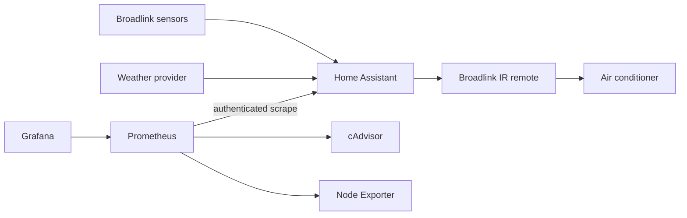

# Home Climate Automation and Observability

A Docker Compose home-lab project that normalizes indoor Broadlink sensor data and outdoor weather in Home Assistant, computes a bounded non-cumulative AC target, sends full-state commands through a Broadlink IR remote, and correlates the automation with container and Linux host health.

Real device onboarding is intentionally manual. This repository contains no household identifiers, network details, credentials, learned IR codes, or fabricated operational results.

## Why three observability levels?

- Home Assistant metrics answer: what is happening in the house and automation?
- cAdvisor answers: what is happening to each container?
- Node Exporter answers: what is happening to the Linux host?

Home Assistant Recorder provides state history, logbook entries, and automation traces. Prometheus samples numerical and infrastructure metrics and evaluates alerts. Grafana provides dashboards, correlation, and exploration.

## Architecture

Five pinned containers are split into independently managed projects:

- `home-automation`: Home Assistant Container on host networking for LAN discovery.
- `observability`: Prometheus, Grafana, cAdvisor, and Node Exporter. Prometheus/Grafana/cAdvisor share an internal bridge; Node Exporter binds only to the configured trusted host address.

The reference hardware is a Linux mini PC running Docker Engine with enough storage for the configured 90-day/10-GB Prometheus retention. ARM64 and AMD64 depend on upstream image availability.

## First run

1. Install Docker Engine, Docker Compose v2, `make`, `jq`, and optionally ShellCheck.
2. Run `make bootstrap`.
3. Set `HOST_IP` and `GRAFANA_BIND_ADDRESS` in `.env` to appropriate trusted host addresses. Do not use a public interface.
4. Start only Home Assistant: `make up-ha`, then open port 8123 from the trusted LAN and complete onboarding.
5. Follow [Broadlink setup](docs/broadlink-setup.md), add a weather integration in **Settings → Devices & services**, and complete [entity mapping](docs/entity-mapping.md).
6. Create a dedicated Home Assistant user, sign in as it, open its profile, create a long-lived access token, and save only the token value in `secrets/home_assistant_token` with mode `600`.
7. Learn all five full-state IR commands, leave automation disabled, and test each command manually.
8. Start observability with `make up-observability`. Prometheus is local-only on `127.0.0.1:9090`; Grafana is on the configured trusted address and port.
9. Verify all Prometheus targets are up, then run `scripts/discover-ha-metrics.sh`. See [observability](docs/observability.md) if exporter names need reconciliation.
10. Enable control only after reviewing traces and safety settings.

The policy always recomputes from the baseline: warming → 23°C, stable → 24°C, cooling → 25°C with defaults. It requires a valid 2-hour trend, 15 minutes of target stability, a changed setpoint, at least 30 minutes since the prior command, and an available adapter. Monitoring continues while control is disabled.

## Commands

Run `make bootstrap`, `make up`, `make down`, `make restart`, `make up-ha`, `make down-ha`, `make up-observability`, `make down-observability`, `make validate`, `make logs`, `make status`, or `make backup`.

`make validate` validates Compose, Prometheus, dashboards, shell scripts (when ShellCheck exists), and the actual Home Assistant configuration. It does not prove LAN discovery, sensor freshness, IR transmission, or physical AC state.

## Security and limitations

cAdvisor requires privileged access plus read-only host/Docker mounts; compromise could expose substantial host metadata. It has no published port and lives on an internal bridge. Node Exporter exposes host details and must bind only to a trusted LAN address. Prometheus is localhost-only. Grafana disables anonymous access and registration. Use a VPN or secured reverse proxy for remote access; this project configures neither and requires no port forwarding.

Broadlink IR is stateless: successful action completion means the Broadlink accepted a command, not that the AC received it or changed state. The counters therefore describe accepted sends, not physical outcomes. The automation logs failures through Home Assistant traces without retry loops.

Alertmanager, Loki/Alloy, and positive AC-state feedback are logical future extensions. Kubernetes, MQTT, Node-RED, custom backends, public exposure, and cloud hosting are deliberate non-goals.

## Screenshots

Repository owner: replace these placeholders only with sanitized real screenshots after operation is verified.

- `docs/screenshots/climate-dashboard.png` — Home Assistant climate dashboard.
- `docs/screenshots/grafana-climate.png` — Grafana Climate Overview.
- `docs/screenshots/grafana-infrastructure.png` — Grafana Infrastructure Overview.

See [architecture](docs/architecture.md) and [troubleshooting](docs/troubleshooting.md) for operating details.
