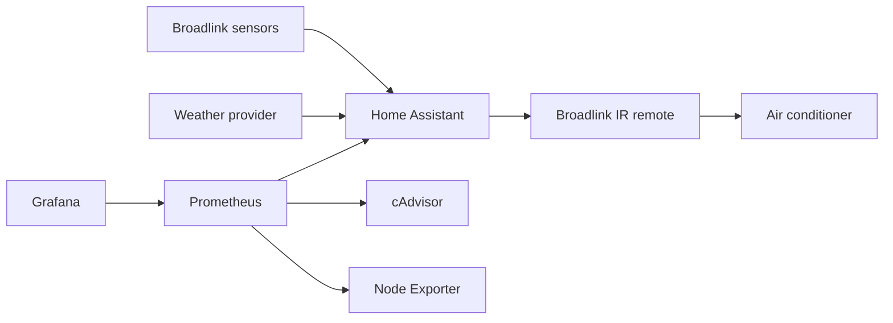

# Home Climate Automation

This is a Docker Compose setup for experimenting with weather-aware AC control in Home Assistant.

The setup is designed to read indoor temperature and humidity from Broadlink sensors, compare them with outdoor weather data, and send a full AC state through a Broadlink IR remote. The dashboards bring the climate data together with mini PC and container metrics.

## How the AC target works

The normal baseline is 24°C:

- outdoor temperature warming: 23°C
- outdoor temperature stable: 24°C
- outdoor temperature cooling: 25°C

The target is always calculated from the baseline, so it does not keep stepping up or down. Home Assistant waits for a stable trend, avoids sending the same target twice, and keeps at least 30 minutes between IR commands.

## Project layout

- `home-automation/` — Home Assistant config, automation, and dashboard
- `observability/` — Prometheus, Grafana, cAdvisor, and Node Exporter
- `scripts/` — setup, validation, backup, and restore helpers

The Home Assistant and observability stacks can be started separately.

## Setup

Prerequisites: Docker Engine, Docker Compose v2, GNU Make, and `jq`.

1. Run `make bootstrap` and review the generated `.env`.
2. Start Home Assistant with `make up-ha` and finish its normal onboarding.
3. Add the Broadlink integration and a weather integration with temperature and humidity, such as OpenWeatherMap.
4. Follow [Broadlink setup](docs/broadlink-setup.md) and [map the source entities](docs/entity-mapping.md).
5. Create a Home Assistant token for Prometheus and save it in `secrets/home_assistant_token`.
6. Start monitoring with `make up-observability`.
7. Run `make validate` after changing the configuration.

Useful commands are `make up`, `make down`, `make logs`, `make status`, and `make backup`.

## One limitation

Broadlink IR is one-way. A successful send means the Broadlink accepted the command; it does not confirm that the AC received it. Keep the automation disabled while learning or testing commands. Disable it before using the physical remote when a manual setting needs to remain in place.
